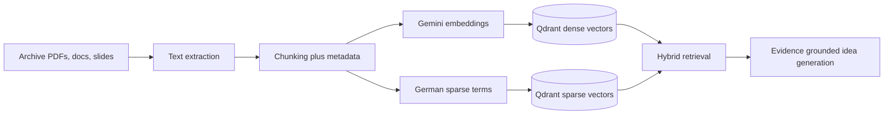
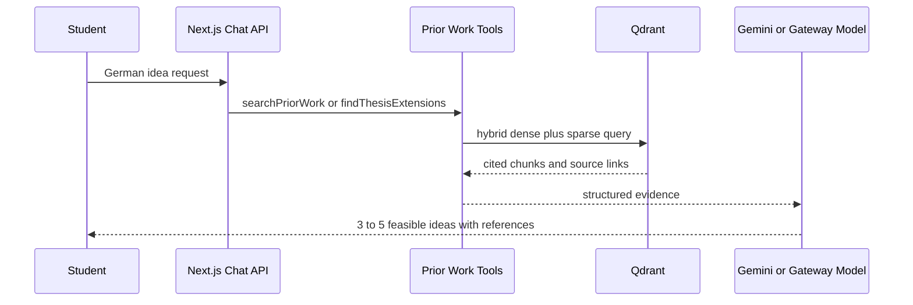
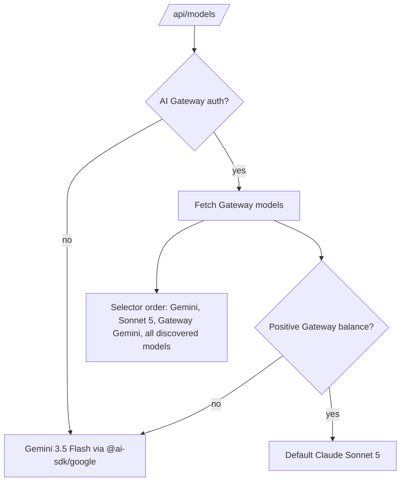

# Diplomarbeit Ideen

AI/ML thesis idea engine for HTL Donaustadt. The app helps students find realistic Diplomarbeit topics by retrieving prior projects from the archive, grounding every idea in cited evidence, and routing generation through Gemini or Vercel AI Gateway depending on available quota.

## Core Pipeline



The retrieval layer is corpus first. Prior theses are normalized into stable project IDs, source paths, chunk text, titles, departments, years, and retrieval links. Qdrant stores dense semantic vectors plus sparse lexical signals so German compounds, acronyms, project names, and exact technology terms stay searchable.

## Runtime Flow



The assistant is optimized for German Diplomarbeit workflows. Prompts require archive lookup before ideation, concise proposals, direct source labels, feasibility notes, and evaluation criteria.

## Model Routing



Default generation uses `gemini-3.5-flash` through `@ai-sdk/google`. Gateway support remains enabled when `AI_GATEWAY_API_KEY` or Vercel OIDC is present. The selector fetches the live Gateway catalog, prioritizes Sonnet 5, and keeps every other available language model selectable.

## Stack

- Next.js App Router and Vercel AI SDK for streaming chat, tools, auth, persistence, and artifacts.
- `@ai-sdk/google` for direct Gemini chat, title generation, and embeddings.
- Vercel AI Gateway for optional multi-provider model routing.
- Qdrant Cloud for hybrid dense plus sparse retrieval.
- Neon Postgres, Redis, and Vercel Blob for template persistence.

## Checks

```bash
pnpm env:check
pnpm corpus:ingest:dry-run
pnpm test:unit
pnpm check
pnpm build
```
